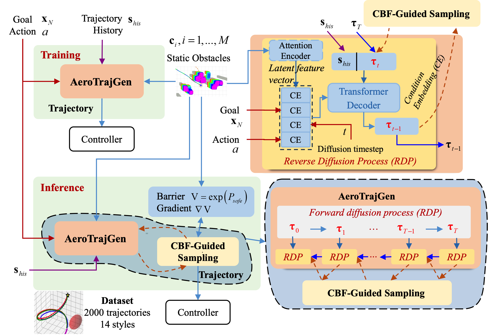

# Safer Trajectory Planning with CBF-guided Diffusion Model for Unmanned Aerial Vehicles

[]()

## Run

```bash
python AeroDM_ObstacleAware_Training_Test.py
# or
python -m aerodm_core
```

## Project structure

The active implementation is organized under `aerodm_core/`:

- `config.py` — experiment configuration.
- `models.py`, `model.py` — neural-network components and the high-level model.
- `guidance.py`, `diffusion.py` — barrier guidance and DDPM sampling.
- `losses.py` — training objectives.
- `data.py`, `metrics.py` — reusable data and evaluation utilities.
- `visualization/` — trajectory, result, and maneuver-style plots.
- `reporting.py`, `evaluation.py` — experiment reports and evaluation.
- `experiment.py` — reusable train/load/evaluate orchestration.

`AeroDM_ObstacleAware_Training_Test.py` remains as a thin compatibility launcher
for existing commands, imports, and checkpoints. See
[`aerodm_core/README.md`](aerodm_core/README.md) for the dependency layout.
