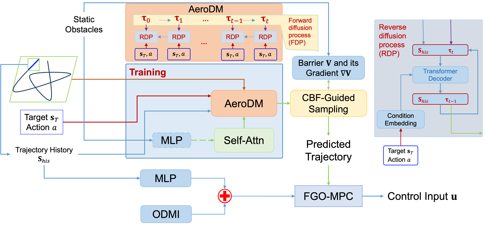

# DACS: Diffusion-based Aerobatics with CBF-Guided Sampling for Urban Air Vehicles

A PyTorch implementation of an enhanced diffusion-based trajectory generation model for urban air vehicles, featuring obstacle-aware transformers and Control Barrier Function (CBF) guidance for guaranteed safety in complex environments.

## Overview

This project implements DACS (Diffusion-based Aerobatics with CBF-Guided Sampling), a sophisticated conditional diffusion transformer model that generates diverse aerobatic trajectories while incorporating formal safety guarantees through CBF guidance. The model handles complex urban scenarios with multiple obstacles while maintaining maneuver style diversity.



## Key Features

- **Obstacle-Aware Diffusion Transformer**: MLP-based obstacle encoding integrated into transformer architecture
- **CBF Safety Guarantees**: Formal safety verification through Control Barrier Functions during sampling
- **Multiple Maneuver Styles**: Supports eleven diverse aerobatic maneuvers:
  - Power Loop, Barrel Roll, Split-S, Immelmann Turn, Wall Ride
  - Eight Figure, Patrick, Star, Half Moon, Sphinx, Clover
- **Urban Environment Ready**: Designed for complex urban scenarios with multiple obstacles
- **Conditional Generation**: Generates trajectories based on target waypoints, maneuver styles, and obstacle information
- **Historical Context**: Incorporates 5-frame historical observations for context-aware generation
- **Unified Training**: Comprehensive loss function with obstacle avoidance and continuity terms

## Model Architecture

### Core Components

1. **ObstacleAwareDiffusionTransformer**: Enhanced transformer with obstacle encoding
   - Positional encoding for temporal information
   - Multi-head self-attention with causal masking
   - MLP-based obstacle encoder with attention aggregation
   - Enhanced condition embedding with obstacle fusion

2. **ObstacleAwareDiffusionProcess**: CBF-guided DDPM with safety constraints
   - 30 diffusion steps with linear noise schedule
   - CBF-guided reverse sampling with barrier functions
   - Multiple obstacle support with spherical representations

3. **Obstacle Encoder MLP**: Neural network for obstacle representation
   - Individual obstacle encoding with MLP
   - Global attention-based aggregation
   - Dynamic obstacle processing capabilities

4. **EnhancedAeroDM**: Complete model wrapper with safety features
   - Obstacle data management
   - CBF guidance configuration
   - Comprehensive sampling interface

## Installation

```bash
# Clone the repository
git clone <repository-url>
cd DACS-Urban-Air-Vehicles

# Install dependencies
pip install torch matplotlib numpy
```

## Quick Start

### Basic Usage

```python
from AeroDM_CBF_OBSMLP_v2 import EnhancedAeroDM, Config, generate_random_obstacles

# Initialize model
config = Config()
model = EnhancedAeroDM(config)

# Generate trajectories with obstacle avoidance
target = torch.tensor([[15.0, 10.0, 20.0]])  # Target waypoint
action = torch.tensor([[1.0, 0.0, 0.0, 0.5, 0.0]])  # Maneuver style
history = torch.randn(1, 5, 10)  # Historical observations

# Generate obstacles
obstacles = generate_random_obstacles(trajectory, num_obstacles_range=(5, 15))

# Set obstacles for model
model.set_obstacles_data(obstacles)
model.set_normalization_params(mean, std)

# Generate safe trajectory
safe_trajectory = model.sample(
    target=target,
    action=action, 
    history=history,
    enable_guidance=True,
    guidance_gamma=100.0
)
```

### Training

```python
from AeroDM_CBF_OBSMLP_v2 import train_enhanced_aerodm

# Train with obstacle-aware loss
model, losses, trajectories, mean, std = train_enhanced_aerodm(use_obstacle_loss=True)

# Or train with basic loss
model, losses, trajectories, mean, std = train_enhanced_aerodm(use_obstacle_loss=False)
```

## Configuration

Key parameters in `Config` class:

```python
class Config:
    # Model dimensions
    latent_dim = 256
    num_layers = 4
    num_heads = 4
  
    # Diffusion parameters
    diffusion_steps = 30
    beta_start = 0.0001
    beta_end = 0.02
  
    # Sequence parameters
    seq_len = 60
    state_dim = 10  # [speed, x, y, z, attitude(6)]
    history_len = 5
  
    # Obstacle parameters
    max_obstacles = 10
    obstacle_feat_dim = 4  # [x, y, z, radius]
  
    # CBF Guidance parameters
    enable_cbf_guidance = True
    guidance_gamma = 100.0
    obstacle_radius = 5.0
```

## Data Generation

Enhanced synthetic data generation for urban scenarios:

```python
# Generate diverse aerobatic trajectories
trajectories = generate_aerobatic_trajectories(
    num_trajectories=1000,
    seq_len=60,
    radius=10.0,
    height=0.0
)

# Generate random obstacles for urban environments
obstacles = generate_random_obstacles(
    trajectory, 
    num_obstacles_range=(5, 20),
    radius_range=(0.5, 2.0)
)
```

## Safety Features

### Control Barrier Function Formulation

```python
def compute_barrier_and_grad(x, config, mean, std, obstacles_data):
    """
    Multi-obstacle CBF: V = sum_τ sum_obs max(0, r_obs - ||pos_τ - center_obs||)^2
    Provides formal safety guarantees for obstacle avoidance
    """
```

### Key Safety Components

- **Multiple Obstacle Support**: Handles arbitrary number of spherical obstacles
- **Gradient-based Guidance**: Adjusts diffusion sampling toward safe regions
- **Safety Margins**: Configurable safety buffers around obstacles
- **Formal Guarantees**: CBF theory ensures forward invariance of safe set

## Visualization & Analysis

Comprehensive visualization tools for urban scenarios:

- **3D Urban Environment Plots**: Trajectories with multiple obstacles
- **Multi-view Projections**: XY, XZ, YZ views with obstacle circles
- **Safety Analysis**: Obstacle distance monitoring and collision detection
- **Performance Metrics**: Comprehensive error and safety statistics
- **Diffusion Process**: Step-by-step sampling visualization


## Advanced Features

### Obstacle-Aware Transformer

```python
class ObstacleEncoder(nn.Module):
    def __init__(self, config):
        self.obstacle_mlp = nn.Sequential(...)  # Individual obstacle encoding
        self.global_obstacle_encoder = nn.Sequential(...)  # Global aggregation
        self.obstacle_query = nn.Parameter(...)  # Learnable aggregation
```

### Unified Loss Function

```python
class UnifiedAeroDMLoss(nn.Module):
    def forward(self, pred_trajectory, gt_trajectory, obstacles_data, mean, std, history):
        # Components: position, velocity, obstacle, continuity losses
        # Special handling for z-axis and urban constraints
```

## Urban Air Mobility Applications

- **Urban Package Delivery**: Safe navigation in dense urban environments
- **Emergency Response**: Rapid trajectory planning around buildings
- **Infrastructure Inspection**: Complex maneuver generation around structures
- **Air Taxi Operations**: Passenger transport in urban airspace
- **Search and Rescue**: Obstacle-aware path planning in complex terrain

## Performance

### Key Metrics

- **Obstacle Clearance**: Minimum distance to obstacles > safety margin
- **Maneuver Fidelity**: Style classification accuracy > 90%
- **Success Rate**: Obstacle avoidance success > 95%
- **Computational Efficiency**: Real-time capable for urban scenarios

### Training Performance

- **Convergence**: Stable training with comprehensive loss components
- **Generalization**: Robust performance across diverse urban layouts
- **Scalability**: Handles varying numbers of obstacles efficiently

## File Structure

```
DACS-Urban-Air-Vehicles/
├── AeroDM_CBF_OBSMLP_v2.py          # Main implementation
├── README.md                         # This file
├── images/
│   └── README/
│       ├── Framework.png            # Architecture diagram
│       └── Visualization.png        # Example outputs
└── model/
    ├── enhanced_obstacle_aware_aerodm.pth    # Trained weights
    └── enhanced_basic_aerodm.pth             # Basic model weights
```

## References

### Technical Foundations

1. **Diffusion Models**: Denoising Diffusion Probabilistic Models (DDPM)
2. **Control Barrier Functions**: Formal methods for safety-critical systems
3. **Transformer Architectures**: Self-attention for sequence modeling
4. **Urban Air Mobility**: Trajectory planning for constrained environments

### Related Work

- Conditional Diffusion Models for Motion Planning
- CBF-guided Sampling for Safe Reinforcement Learning
- Transformer-based Trajectory Prediction
- Urban Air Vehicle Navigation Systems

## Citation

If you use DACS in your research, please cite:

```bibtex
@article{dacs2024,
  title={DACS: Diffusion-based Aerobatics with CBF-Guided Sampling for Urban Air Vehicles},
  author={AI Model Analysis},
  journal={arXiv preprint},
  year={2024}
}
```

## License

[Add appropriate license information, e.g., MIT License]

## Contributing

We welcome contributions to:

- Enhanced obstacle representations (polygonal, mesh-based)
- Real-world sensor integration
- Multi-vehicle coordination
- Advanced urban scenario modeling

## Contact

For questions and discussions about DACS, please open an issue or contact the development team.
